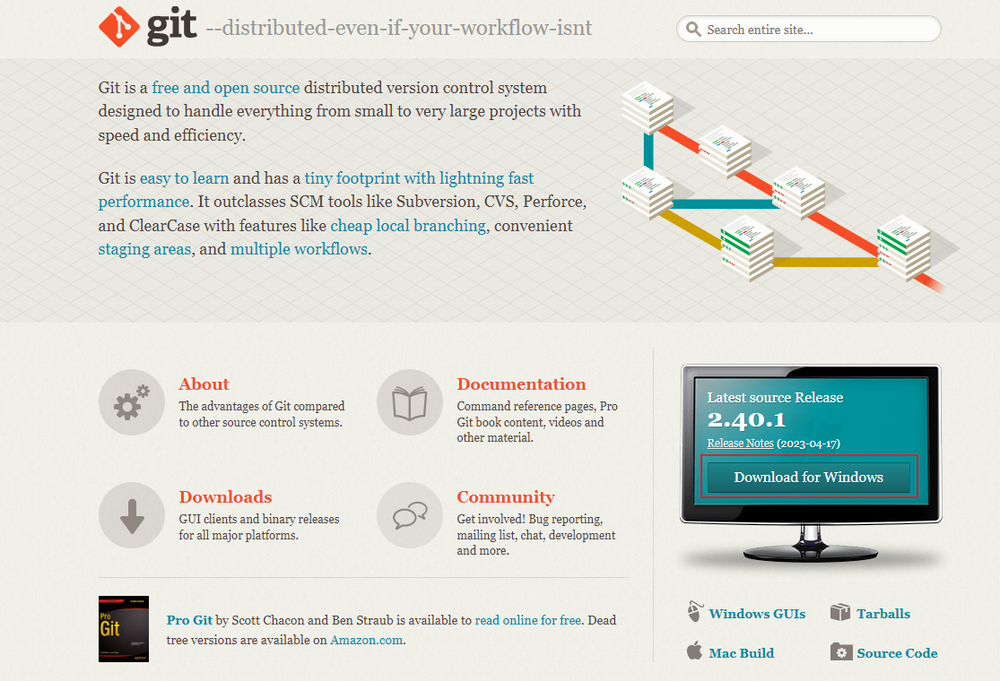
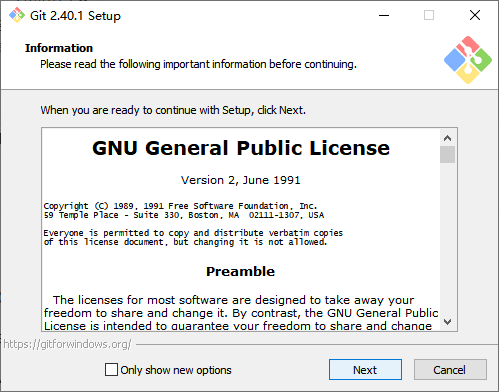
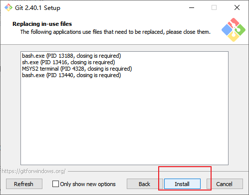
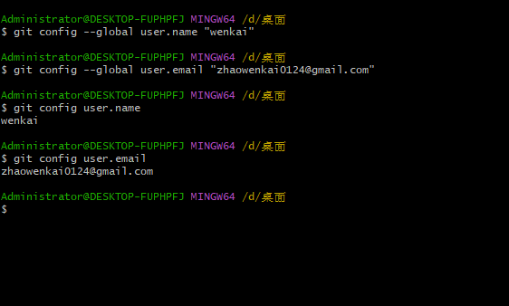

# git 准备流程

## 下载 Git

访问 Git 官网https://git-scm.com,点击"Downloads"。
选择您的操作系统,点击下载按钮开始下载安装文件。
双击安装文件并按提示操作,直到安装完成。

下载



安装



一直下一步就好了



## 配置 Git

打开终端/命令提示符,输入以下命令进行配置:
bash

```markdown
git config --global user.name "wenkai"
git config --global user.email "zhaowenkai0124@gmail.com"
```

设置提交代码时使用的用户名和邮箱。



## 创建 SSH 密钥(可选)

在 github 准备中 [传送门](/zhunbei/github#创建-ssh-密钥)

## 初始化本地仓库

在 github 准备中 [传送门](/zhunbei/github#关联本地仓库与-github-仓库)

## 关联远程仓库(可选)

在 github 准备中 [传送门](/zhunbei/github#关联本地仓库与-github-仓库)

## Git 基本命令

- git add .:跟踪所有改动的文件
- git commit -m "注释":提交本地修改并备注
- git push:推送本地修改到远程仓库
- git pull:拉取远程仓库修改到本地
- git status:查看本地仓库状态
- git log:查看提交历史

## 总结

通过以上流程,我们完成了 Git 的下载、配置和基础使用介绍。掌握了 Git 初始化仓库、关联远程仓库和基本命令等技能。这为我们后续所有的项目开发奠定了基础。
