# 准备

## 注册 GitHub 账号

> 使用我的 gmail 邮箱 zhaowenkai0124@gmail.com ,点击"Sign up"注册按钮。
> 选择用户名、输入 email、密码并验证,点击"Create an account"。
> 验证邮箱地址,完成注册。

_github 主页_


_登良窗口_

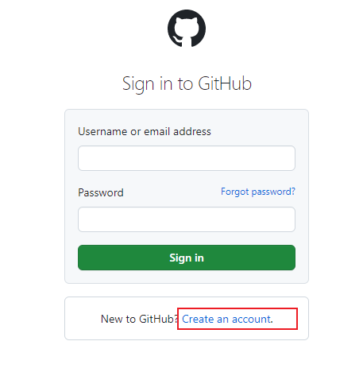

_账号填入内容_

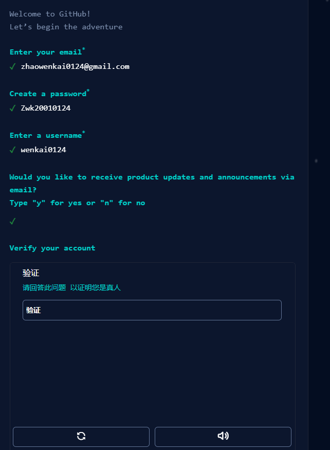

_选择使用人_


## 创建仓库(Repository)

> 登陆 GitHub 后,点击右上角的"+"号,选择"New repository"。
> 输入仓库名称,选择节点初始化状态(空仓库或带有 README)。
> 选择仓库可见性(公开 or 私有),clicked"Create repository"。
> 仓库创建成功,显示仓库主页。

_登陆成功界面_

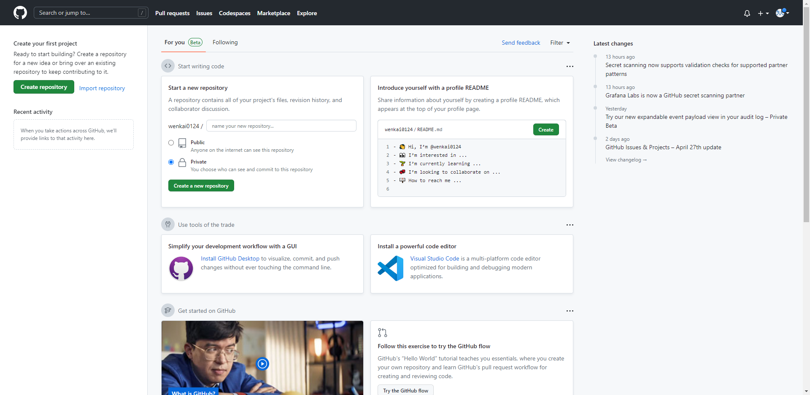

_创建仓库界面_

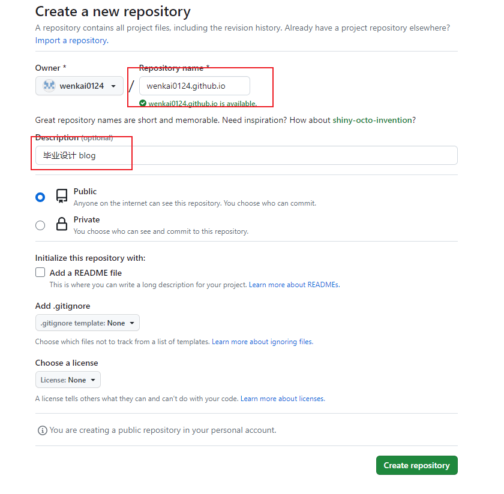

_创建成功画面_

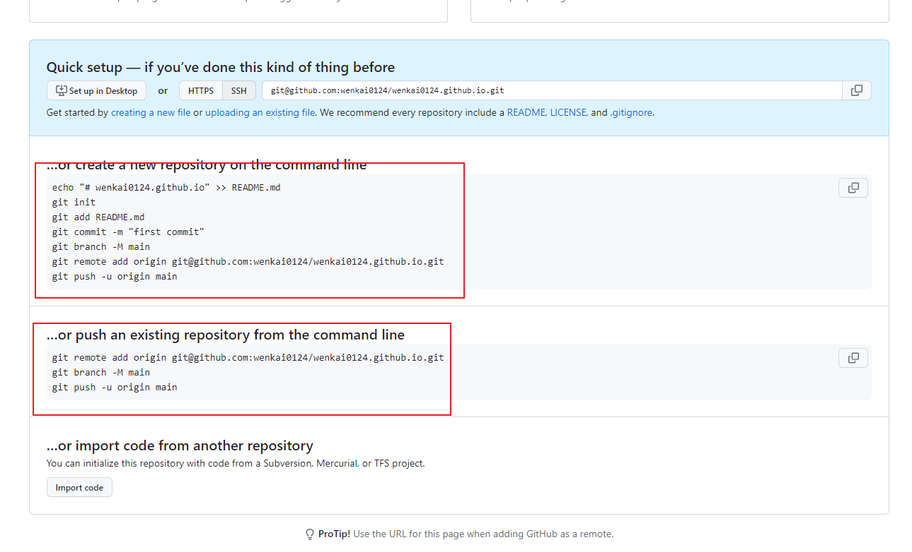

## 关联本地仓库与 GitHub 仓库

> 根据上文提示创建本地仓库

找到本地文件夹 右键通过 git Bush 打开 出现当前窗口 并执行以下操作

```markdown
echo "# wenkai0124@github.io" >> README.md
git init
git add README.md
git commit -m "first commit"
git branch -M main
git remote add origin git@github.com:wenkai0124/wenkai0124.io.git
git push -u origin main
```

然后关联仓库

```markdown
git remote add origin git@github.com:wenkai0124/wenkai0124.io.git
git branch -M main
git push -u origin main
```

_本地仓库远端仓库关联过程_

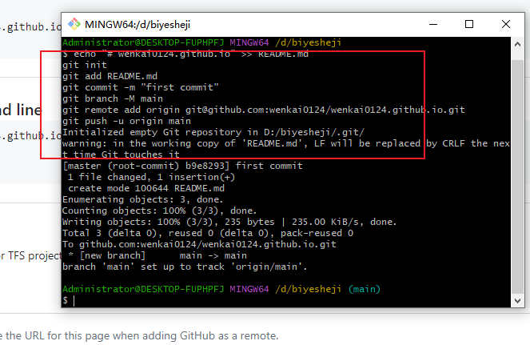

_创建连接秘钥_

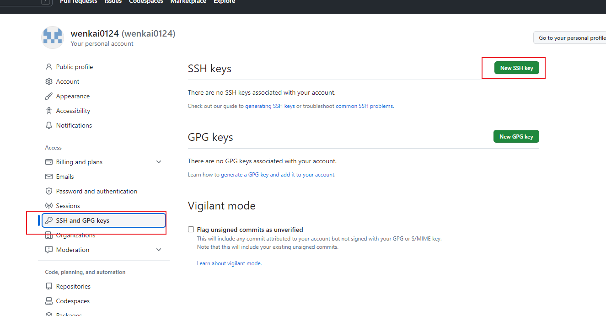

## 创建 SSH 密钥

打开 Git Bash,输入:

ssh-keygen -t rsa -C "zhaowenkai0124@gmail.com"

```markdown
ssh-keygen -t rsa -C "zhaowenkai0124@gmail.com"
```

连续 3 次回车。这会在用户.ssh 目录下生成 id_rsa 和 id_rsa.pub 两个 SSH 密钥文件。
SSH 密钥用于连接 GitHub 而不需要在每次推送时输入用户名和密码。

## 登录 GitHub 并添加 SSH 密钥

打开 GitHub,点击头像下拉菜单,选择"Settings"。
选择"SSH and GPG keys",点击"New SSH key"按钮。
在"Title"字段输入标题,打开 id_rsa.pub 文件,复制内容并粘贴到"Key"字段。
点击"Add SSH key"以添加密钥。

_添加私钥_

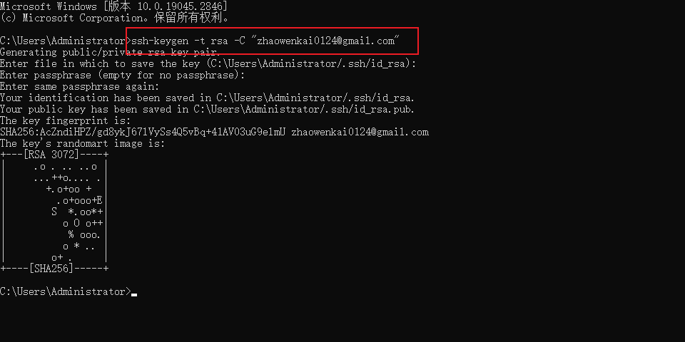

_将公钥文件添加到 github 中_

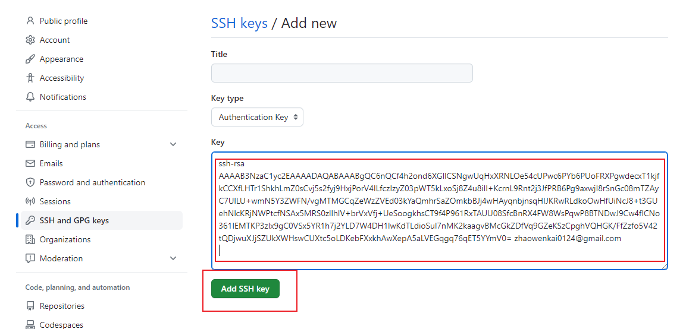

## 添加成功 推送代码

此时即可推送相应代码

执行 以下指令

```markdown
添加所有更改的文件
git add .
增加提交信息
git commit -m "这里是提交信息"
推送变更
git push
```

_指令执行_

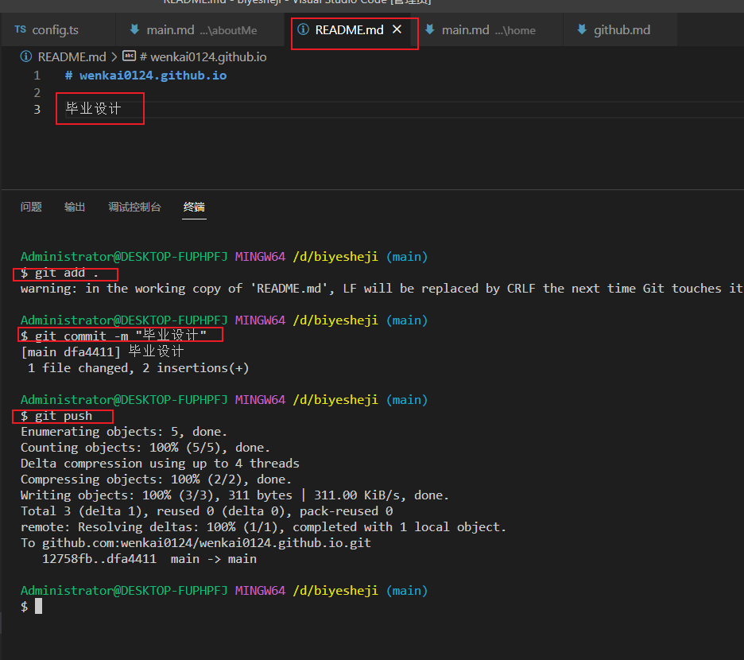

_关联成功 代码推送展示_

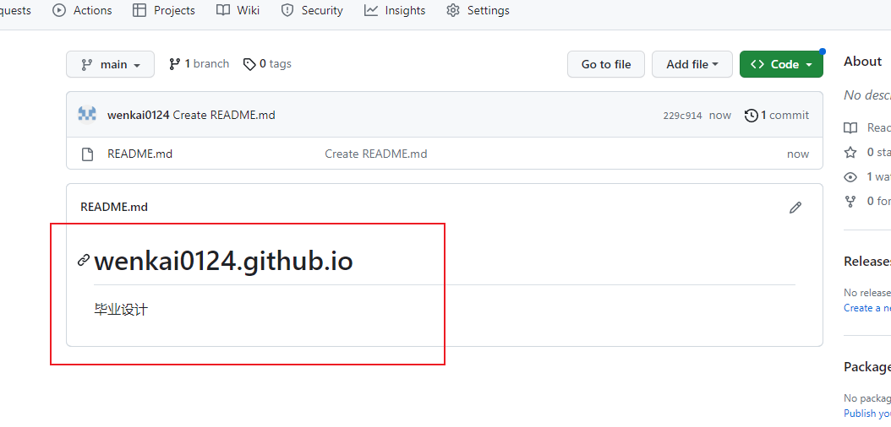

## 总结

GitHub 上的仓库和本地仓库就关联起来了,以后可以直接使用 git push 和 git pull 与 GitHub 仓库同步!
通过以上流程,我们完成了 GitHub 注册、创建项目、添加 SSH 密钥和关联本地仓库等操作。理解了 GitHub 的基本使用流程和 Git 命令,这为我们后续的项目开发制定了基础。
