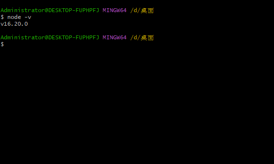

# node 准备

> 因为 vitepress 是通过 node.js 实现的功能 所以需要在电脑中安装 node

## 下载安装 node

node 官网下载

安装一直下一步就行

验证安装结果

## node 简介

Node.js 是一个基于 Chrome V8 引擎的 JavaScript 运行时环境。它允许你在服务器端运行 JavaScript 代码,并且具有以下主要特性:

- 事件驱动: Node.js 大量使用事件和回调,因此它是非阻塞式 I/O 模型,轻量级和高效。
- 非阻塞式 I/O: Node.js 使用 libuv 库,实现了可伸缩的非阻塞式 I/O 操作。
- 单线程:Node.js 使用单线程模型,适用于 I/O 密集型应用。
- 跨平台:可以在 Windows、Mac OS X 和 Unix/Linux 等多平台上编写和执行。
- 包生态:通过 npm,Node.js 具有丰富的第三方模块生态系统。
  Node.js 主要用于开发 I/O 密集型的 web 应用,常用来搭建 web 服务器和开发网络程序。主要应用场景有:
- Web 服务器:使用 Node.js 可以轻易地搭建一个高效的 web 服务器。常见的 web 框架有 Express、Koa 等。
- I/O 密集型应用:适用于事件驱动模型的应用,例如聊天室、弹幕系统等。
- API 设计:Node.js 适用于开发和调用 RESTful API。
- 流处理:Node.js 使用流可以高效处理大文件传输、下载等场景。
- 移动应用后台:使用 Node.js 开发移动应用的后台接口或服务。
  Node.js 项目的主要构成部分有:
- 包(package):通过 npm 管理和发布。一个项目依赖的所有第三方模块被统一在 package.json 中描述。
- 模块(module):使用 exports 和 require 实现模块化。一个文件就是一个模块。
- 事件(events):使用 events 模块和回调函数实现事件驱动。
- 流(stream):使用流可以处理大文件传输场景,流被设计为可读、可写、可读写。
- 全局对象(global):在任何模块内部,都可以使用 global 对象,主要包括 setTimeout、console 等。
  学习 Node.js,需要掌握 JavaScript 语言基础,理解事件驱动和非阻塞 I/O 模型,会使用 npm 管理包,并要熟练使用流、事件等核心概念。常用的 Node.js web 框架有 Express、Koa2、Egg.js 等,都是学习 Node.js 不可或缺的一部分。
  Node.js 已成为服务端开发不可或缺的技术栈,有着广泛的应用前景。
