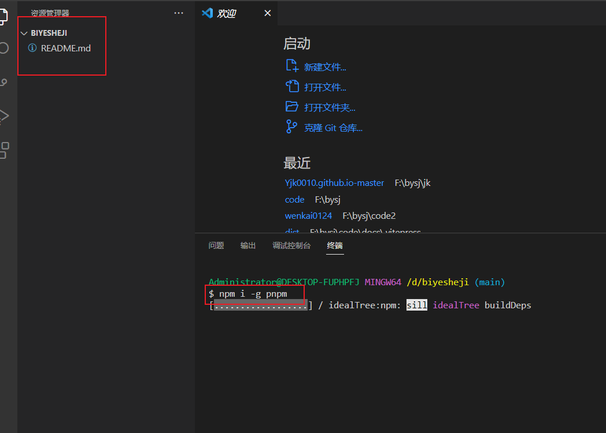
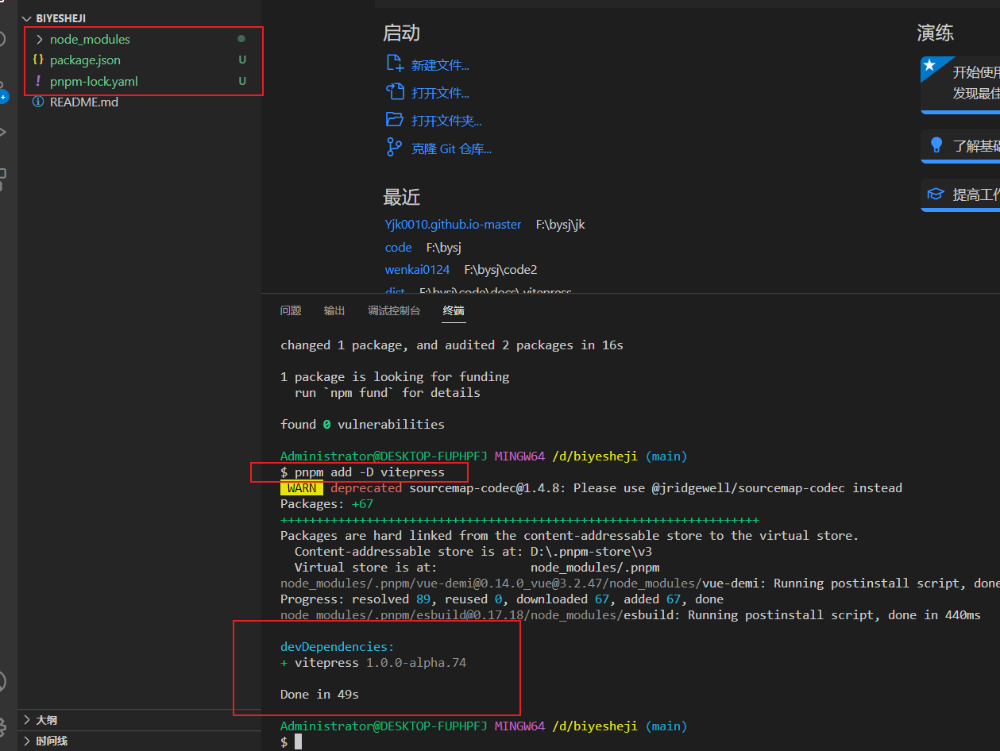
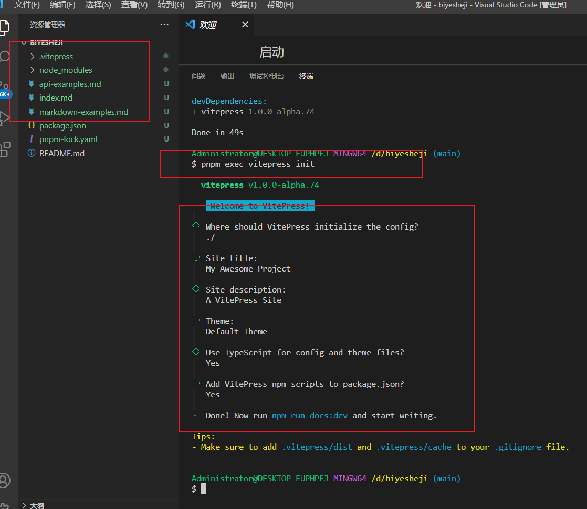
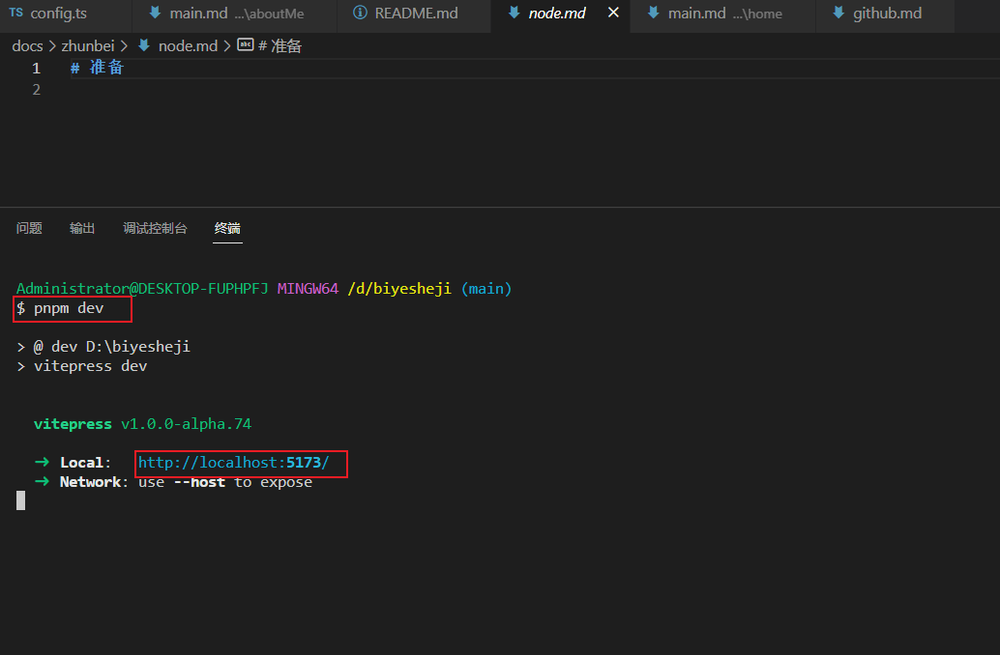

# vitepress 准备中

## node 安装 pnpm

vitepress 推荐了使用 pnpm 进行包管理 所以这边先下载 pnpm

通过 node 下载

指令

```markdown
npm i -g pnpm
```



## 通过 pnpm 安装 vitepress

安装 指令

```markdown
pnpm add -D vitepress
```



初始化指令

```markdown
pnpm exec vitepress init
```



## 总结

到这里 整个项目搭建就完成了
现在可以通过 pnpm dev 让其跑起来了



> 出现以下页面就说明项目已经跑成功了
> 本地地址是 图示的地址

通过浏览器直接访问该地址就能看到相应页面了
