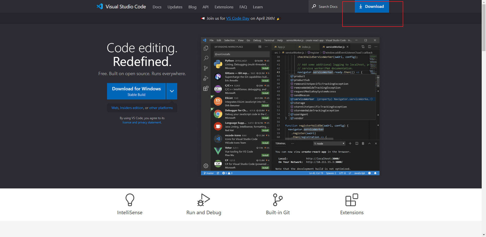

# vscode 准备

> 编写代码需要有一个顺手的编辑器 这里我选择的是 vs code

## 下载

官网下载

安装过程

安装成功

## 使用汉语

install 汉语

重新启动

安装成功

## vscode 简介

VS Code 是微软开发的一款免费、开源的现代 IDE。它具有以下主要特点:

- 跨平台:运行在 Windows、macOS 和 Linux 上。
- 支持多种语言:内置对 JavaScript、TypeScript、CSS、Less 等多种语言的支持,并可通过扩展插件支持其他语言。
- 轻量且快速:相比于其他 IDE,VS Code 更轻量,启动和操作非常快速。
- 扩展性强:丰富的自定义插件扩展生态系统。
- 嵌入终端:内嵌广受欢迎的终端工具,比如 cmd、PowerShell、Bash 等。
- 智能代码感知:内置对代码补全、接口提示、导航、重构等广泛的智能功能。
- Git 集成:内置 Git 版本控制功能,可直接在编辑器中进行提交、拉取、推送等操作。
- 自定义 UI:可以通过更换主题、调整窗口布局等个性化设置 UI。
  VS Code 比较适合前端开发者使用,主要因为:

1. 对前端常用语言和框架内置支持很好,包括 JavaScript、TypeScript、HTML、CSS、Vue、React 等。
2. 拥有丰富的前端相关插件和扩展,包括 ESLint、Prettier、Emmet 等。
3. 轻量和快速的启动性能,非常适合前端开发流程。
4. 内置终端和 Git 支持,方便版本控制和其他终端操作。
5. 美观大方的 UI 和主题,提高开发体验。
   学习 VS Code,需要熟悉以下方面:
6. 理解 VS Code 的项目管理、编辑窗口、资源管理器等基本界面和功能。
7. 会使用 VS Code 的基本快捷键,提高开发效率。如格式化代码、注释、导航等。
8. 掌握安装、配置和使用前端相关插件,如 ESLint、Prettier、GitLens 等。
9. 会在终端和 Git 面板中使用基本命令,进行版本控制和其他终端操作。
10. 自定义 VS Code 的设置,包括主题、字体、窗口管理等个性化设置。
11. 了解官方文档和其他学习资源,随时查阅问题。

VS Code 已成为当下最流行的开发 IDE 之一,特别是在前端开发社区深受欢迎
